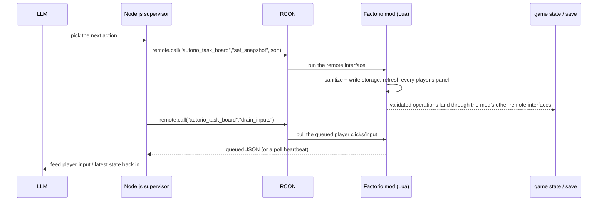
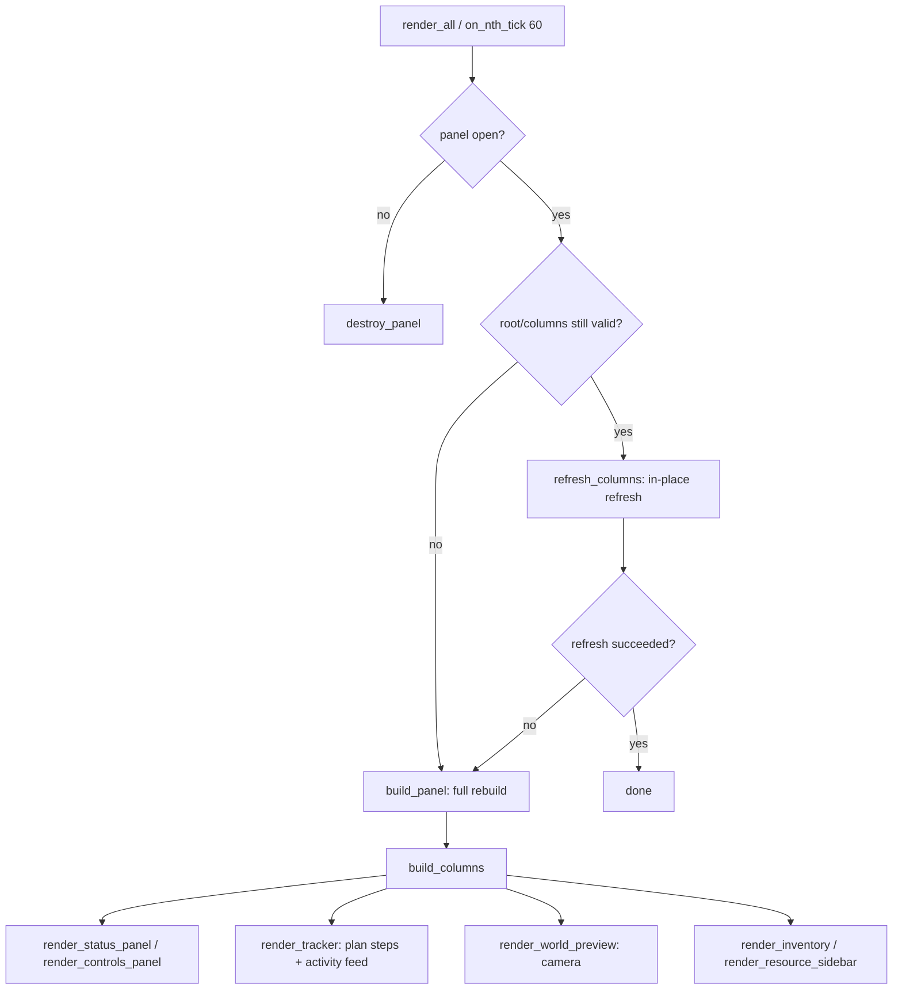
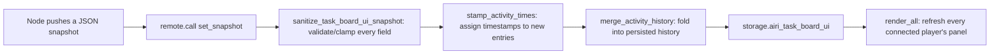
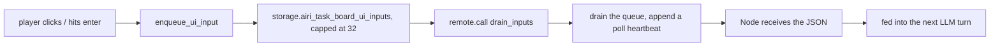
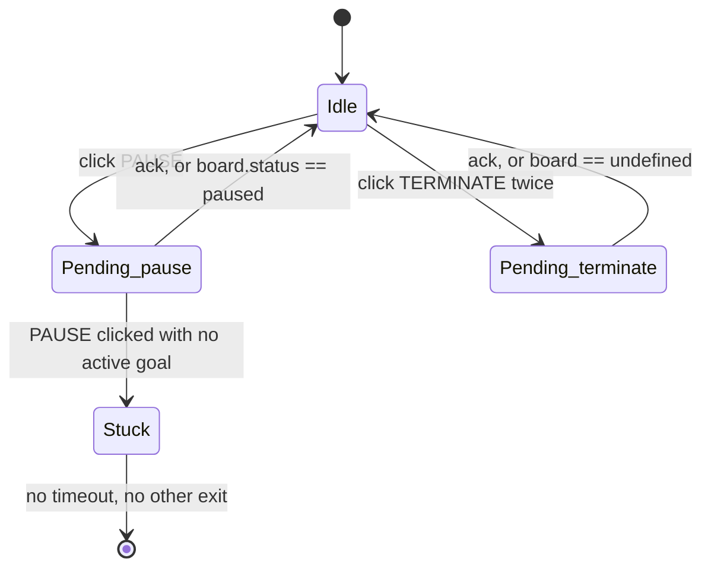
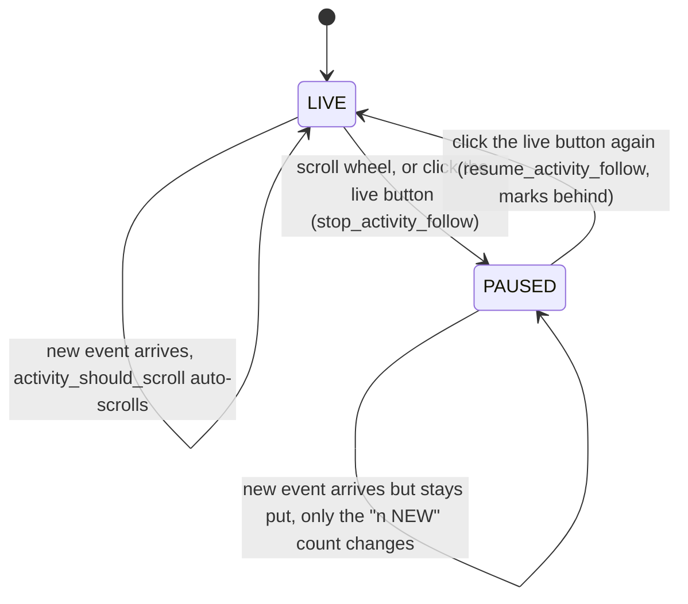
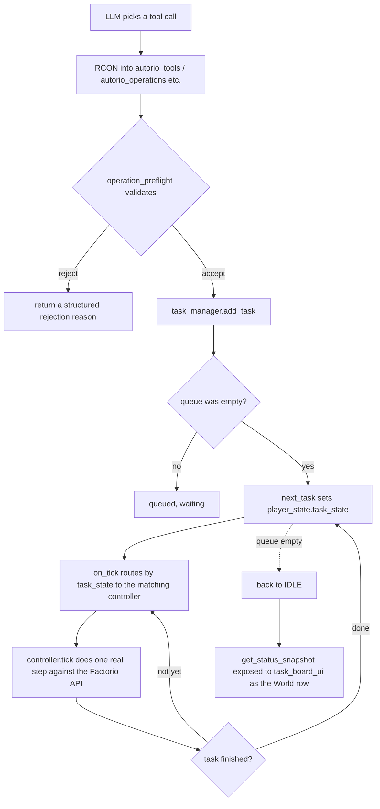
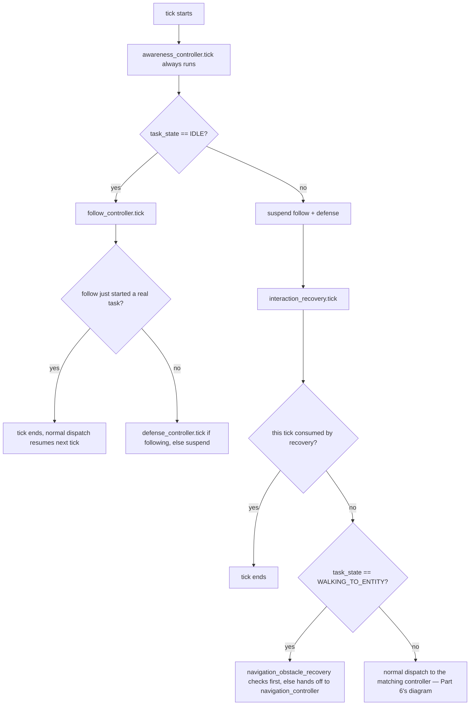

# NPC console & harness architecture — 2026-09-18

This document explains how the standalone-NPC runtime is wired together, from the LLM's tool calls down to the Factorio-native task execution loop and the in-game console UI, and records the findings from two `/code-review` passes over that code. It was produced by Claude (Anthropic) while walking a developer through the codebase and reviewing it; the architecture description and the findings below are Claude's own reading of the source, not a human-authored spec, so treat it as a snapshot to verify against the code rather than a promise of exact behavior.

## Overview

The runtime is four layers: an LLM chooses actions, a Node.js supervisor drives the Factorio server over RCON, the Factorio mod (TypeScript compiled to Lua) turns those into real game-state changes, and the mod also renders an in-game console UI for players.

```text
LLM decision
  -> Node.js supervisor (deploy/pterodactyl/runtime-v8/supervisor.mjs)
  -> RCON commands
  -> Factorio mod (Lua) -- packages/autorio/src/
  -> real game state
  -> console UI back to players
  -> player input drained back over RCON
  -> back to the LLM
```

## Part 1 — System architecture

Factorio itself has no idea an LLM exists: the Node.js process is the only bridge, issuing one-shot RCON commands and polling for results.



Key points:

- No long-lived connection: every interaction is one independent RCON command (`/silent-command`), issued from [supervisor.mjs](../deploy/pterodactyl/runtime-v8/supervisor.mjs).
- Lua only exposes a bounded set of `remote` interfaces (`autorio_task_board`, `autorio_operations`, `autorio_follow`, etc.) — never arbitrary Lua or console commands, per the AGENTS.md invariant.
- `drain_inputs` doubles as the heartbeat: it returns real queued input when there is any, and a lightweight `poll` request otherwise, so the Node side always knows whether the game side is still alive without a separate channel.

## Part 2 — UI render pipeline

[task_board_ui.ts](../packages/autorio/src/task_board_ui.ts)'s core rule: refresh an already-open panel in place, never rebuild it, because rebuilding a scroll-pane resets its scroll position and Factorio gives Lua no way to read that position back.



Two deliberate exceptions called out in the source comments:

- `refresh_columns` never clears the tracker section, because it owns two scroll-panes (plan steps and the activity feed).
- `refresh_world_preview` never clears the preview column, because rebuilding it would reset the zoom slider mid-drag. Only the two functions that actually build these sections fall back to a full rebuild, and only when they can't find the child elements they expect.

## Part 3 — Data flow

Two independent one-way paths, each corresponding to one arrow in the top-level diagram.

**Downstream (LLM -> screen):**



**Upstream (screen -> LLM):**



Why it's built this way:

- `sanitize_task_board_ui_snapshot` trusts nothing: every field has a default and a length cap (steps capped at 30, activity at 18), because the data arrives as remote JSON and a Node-side bug must never reach Lua runtime unvalidated.
- `stamp_activity_times` exists because snapshots only carry a small recent-activity window (to keep RCON payloads bounded), but a timestamp has to be fixed the first time an entry is seen, or the same entry re-appearing in a later snapshot gets treated as new.
- The 32-entry input queue cap exists to bound memory if a player mashes buttons while the Node side is disconnected.
- The two paths are fully decoupled: a push doesn't wait for an ack, and a drain doesn't wait for a push — which is exactly the root cause of the lifecycle bug in finding #1 below: the "did this finish?" check has to guess, instead of getting a definite answer.

## Part 4 — PAUSE / TERMINATE lifecycle state machine

Pause and Terminate can't take effect the instant they're clicked; they wait for the Node side to confirm (to avoid a network hiccup registering several clicks as one). That wait lives in `LIFECYCLE` ([task_board_ui.ts:379](../packages/autorio/src/task_board_ui.ts)), and can end two ways: the runtime calls `ack_lifecycle`, or the console guesses from the latest snapshot that the action must already be done.



The two "self-heal" conditions aren't symmetric:

- Terminate's self-heal condition is `board === undefined`. If there was no active goal to begin with, `board` is already undefined, so clicking TERMINATE self-heals instantly. No problem.
- Pause's self-heal condition is `board?.status === 'paused'`, which **requires a `board` to exist**. But the Controls panel's own tooltip explicitly says PAUSE is also valid with no active goal ("stop the current world work"), and in that case `board` never becomes `'paused'` — the self-heal condition is permanently false.
- Unlike `TERMINATE_CONFIRM_TICKS` (a 5-second confirmation window that auto-expires), `LIFECYCLE`'s pending state originally had **no tick-based timeout at all**; it only cleared via `ack` or the self-heal condition above.

Consequence (as found): if the Node side didn't call `ack_lifecycle` for this particular "pause with no goal" case, both Pause and Terminate would stay permanently disabled for that player, showing "PAUSING..." forever — and this was stored in synchronized save state, so it would survive a relog.

**Status: fixed.** [`fa9ff0f`](../../../commit/fa9ff0fe3a6574ac37297bf46ff858232b835759) ("fix: bound task board lifecycle pending state") landed a `LIFECYCLE_PENDING_TICKS` (1 hour) timeout on the pending state, so a lost ack can no longer disable the controls forever. The same commit also fixed finding #5 below (NEW TASK now respects the same pending-lifecycle guard as Pause/Terminate).

## Part 5 — Activity feed follow/scroll state machine

The activity feed needs to switch between "auto-follow the newest event" and "don't interrupt the player while they're scrolling back through history." That state lives in [task_board_activity.ts](../packages/autorio/src/task_board_activity.ts)'s `ActivityView` (`follow` / `behind` / `seen_key`).



This mechanism is otherwise solid — `activity_rows_diff` only appends/removes the changed rows instead of rebuilding the whole list, which is what keeps the player's scroll position stable.

But one side feature, "hover to hold, un-hover to catch up," is **already dead**: the source comment says hovering over the feed should hold it in place and un-hovering should catch it up immediately, but the function backing it, `set_activity_hover` ([task_board_activity.ts:282](../packages/autorio/src/task_board_activity.ts)), is now a no-op shim that always returns `follow: false`, so hover/un-hover has zero effect on the main console's feed today. The same feature in the Debug popout (`set_debug_activity_hover`) still works correctly, which is why this reads as an unfinished migration rather than an intentional removal. See finding #4 below.

## Part 6 — Task execution loop (the harness core)

Parts 1-5 above are all about what the player sees. What the README/AGENTS.md call the "harness" is a different layer: the deterministic task-execution loop in [control.ts](../packages/autorio/src/control.ts) and [task_manager.ts](../packages/autorio/src/task_manager.ts), which turns an LLM's tool call into a real, in-game action, with no UI involved at all.



Every `task_state` maps to one independent controller module — none of them depend on each other:

| TaskStates | Owning module |
| --- | --- |
| WALKING_TO_ENTITY / WALKING_DIRECT | navigation_controller |
| MINING / PLACING / MOVING_ITEMS / WAITING | basic_operation_runtime |
| HARVESTING | harvest_controller |
| CLEARING_AREA | area_clearing_controller |
| ROTATING | orientation_runtime |
| SETTING_RECIPE | recipe_configuration_runtime |
| CRAFTING | crafting_controller |
| RESEARCHING | research_controller |
| ATTACKING | combat_controller |

The upside of this split is that adding a new behavior only means adding one new `TaskStates` value and one new controller — nothing else has to change. The downside, per finding #2 below, is that nothing enforces the other half of that contract: forgetting to wire a new state into both `next_task()`'s switch and `on_tick`'s dispatch fails silently.

## Part 7 — Preemption & recovery layer

The dispatch diagram above skips one detail: before `on_tick` routes to `controller.tick`, three layers get a chance to preempt it, none of which care what specific task is running.



Each of the three layers owns exactly one concern, and all three exist to catch a real physical failure mode rather than fake completion:

- **`follow_controller`** only runs while idle — it steps aside the instant a real LLM task exists.
- **`interaction_recovery`** handles "too far / wrong angle to interact" (e.g. AIRI walked to the wrong side of a building before trying to place, rotate, or configure it) and consumes the tick outright when it fires, so the normal dispatch never sees a not-yet-recovered scene.
- **`navigation_obstacle_recovery`** watches specifically for "walking toward a target but physically not moving" (90 ticks with no progress), and only steps in during `WALKING_TO_ENTITY`, handing control straight back to the ordinary `navigation_controller` otherwise.

All three map directly to the AGENTS.md rule against replacing physical mechanics (reach, collision, path blocking) with shortcuts.

## Console UI findings

`/code-review` over [task_board_ui.ts](../packages/autorio/src/task_board_ui.ts), [task_board_debug.ts](../packages/autorio/src/task_board_debug.ts), and [task_board_activity.ts](../packages/autorio/src/task_board_activity.ts):

| # | Location | Issue | Failure scenario | Category | Status |
| --- | --- | --- | --- | --- | --- |
| 1 | [task_board_ui.ts:386](../packages/autorio/src/task_board_ui.ts) | Clicking PAUSE with no active goal can permanently stick the lifecycle state | `board` stays undefined forever, `board?.status === 'paused'` is never true, and there was no tick timeout — Pause/Terminate would stay disabled forever | correctness (high) | **Fixed** in `fa9ff0f` |
| 2 | [task_board_ui.ts:260](../packages/autorio/src/task_board_ui.ts) | LLM/player text is written into Factorio rich-text captions unescaped | A stray `[` in a model reply or activity line can be parsed as a rich-text tag, garbling that row | correctness (medium-high) | Open |
| 3 | [task_board_ui.ts:260](../packages/autorio/src/task_board_ui.ts) | `text()`/`integer()` are duplicated near-verbatim in `task_board_debug.ts` | Future sanitization fixes (e.g. #2) are easy to apply to only one copy | reuse (medium) | Open |
| 4 | [task_board_activity.ts:282](../packages/autorio/src/task_board_activity.ts) | The activity feed's hover-to-hold/un-hover-to-catch-up behavior is dead code | `set_activity_hover` always returns `follow: false`; the documented behavior never happens | simplification (medium) | Open |
| 5 | [task_board_ui.ts:1065](../packages/autorio/src/task_board_ui.ts) | NEW TASK doesn't guard against a pending PAUSE/TERMINATE the way those two buttons guard each other | Clicking NEW TASK while TERMINATE is awaiting confirmation can send two conflicting destructive control inputs back to back | correctness (medium) | **Fixed** in `fa9ff0f` |

Findings #1 and #5 were fixed in [`fa9ff0f`](../../../commit/fa9ff0fe3a6574ac37297bf46ff858232b835759) shortly after this review, before this document was pushed.

## Harness findings

`/code-review` over [control.ts](../packages/autorio/src/control.ts), [task_manager.ts](../packages/autorio/src/task_manager.ts), [interaction_recovery.ts](../packages/autorio/src/interaction_recovery.ts), [navigation_obstacle_recovery.ts](../packages/autorio/src/navigation_obstacle_recovery.ts), [follow.ts](../packages/autorio/src/follow.ts), [defense.ts](../packages/autorio/src/defense.ts), and [awareness.ts](../packages/autorio/src/awareness.ts):

| # | Location | Issue | Failure scenario | Category |
| --- | --- | --- | --- | --- |
| 1 | [control.ts:560](../packages/autorio/src/control.ts) | Auto-defense only ever ticks while idle and actively following a player | During any real task (mining, crafting, walking, etc.) `defense_controller.tick` is never called, so `set_auto_defense(true)` is a no-op while AIRI is working — worth confirming whether this is intentional | correctness (medium-high, needs confirmation) |
| 2 | [task_manager.ts:154](../packages/autorio/src/task_manager.ts) | An unrecognized `TaskStates` value has no fallback or timeout anywhere | `PICKING_UP`/`PLACING_IN_CHEST` are already declared but wired into neither `next_task()`'s switch nor `on_tick`'s dispatch — proof that this gap is easy to hit; if ever triggered, the NPC freezes in that state forever with no error | altitude (medium, currently dormant) |
| 3 | [interaction_recovery.ts:61](../packages/autorio/src/interaction_recovery.ts) | Recovery navigation legs skip the normal "started" telemetry write | `entity_navigation()` pre-sets `started_tick`, so `navigation.ts`'s `acquire()` (and its telemetry record) is skipped for ROTATING/SETTING_RECIPE/MOVING_ITEMS recovery legs, leaving `airi_last_navigation_result` briefly stale/mislabeled | correctness (low, telemetry only) |
| 4 | [follow.ts:66](../packages/autorio/src/follow.ts) | The exact stop-walking call is duplicated 20+ times across 5 files | A future change to how walking state gets reset has to be found and applied at every call site instead of one shared helper | reuse (medium) |
| 5 | [awareness.ts:66](../packages/autorio/src/awareness.ts) | Failed radar-entity creation retries every tick with no backoff | If placement keeps failing, `create_entity` is retried unconditionally in the always-on tick hot path | efficiency (low) |

---

*Both review passes (console UI and harness) were run and written up by Claude via `/code-review`, at the request of a developer exploring this codebase.*
